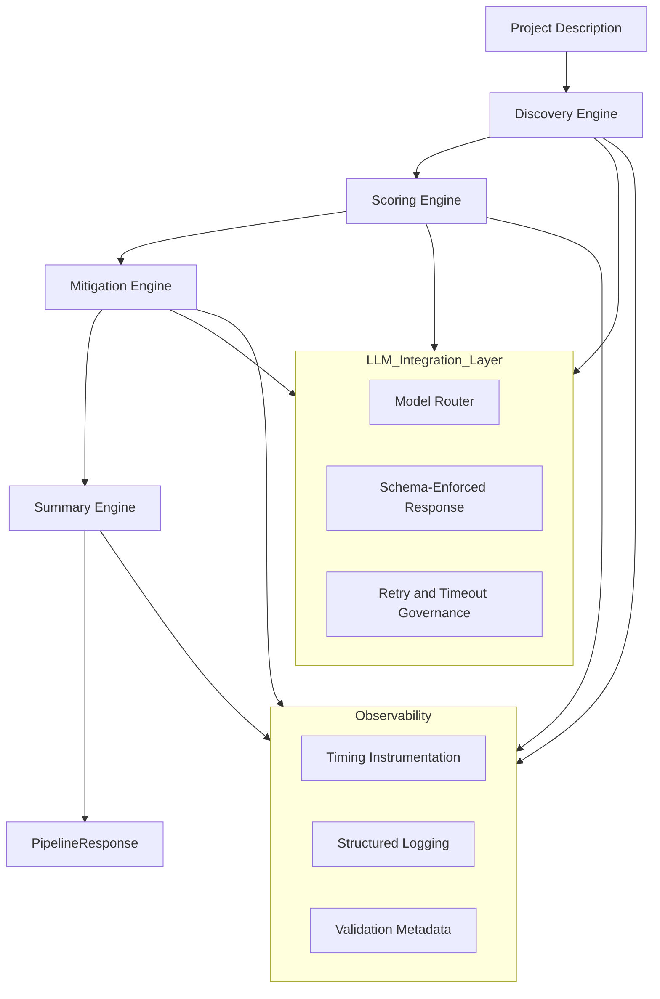

# PreMortem AI


PreMortem AI is an automated, deterministic pre-mortem engine that identifies failure scenarios
before a project begins. It converts free-form project descriptions into a structured, end-to-end
risk package—complete with discovery, scoring, mitigation strategies, themes, and an executive summary.

The system is designed for engineering teams, product organizations, and enterprise environments
that need consistent, auditable, machine-readable risk intelligence.

---

## 1. Overview

PreMortem AI transforms ambiguous project inputs into a structured, validated, and actionable risk report.

The pipeline produces:

- Structured risk items with stable IDs  
- Probability and impact scoring  
- Mitigation strategies tied to each risk  
- Thematic groupings and executive summaries  
- A deterministic `PipelineResponse` for downstream automation  

The architecture prioritizes **reproducibility, schema guarantees, observability, and extensibility**.

---

## 2. High-Level Architecture

PreMortem AI follows a layered, domain-driven architecture engineered for control and auditability.

**LLM Integration Layer**  
Centralized inference, model routing, schema-enforced responses.

**Domain Engines**  
Modular, testable engines for Discovery, Scoring, Mitigation, and Summary generation.

**Pipeline Orchestration Layer**  
Executes domains in sequence with strict validation boundaries and deterministic state management.

**Core Utilities**  
ID generation, logging, text normalization, schema validation, file I/O, and timing instrumentation.

**API + CLI Interfaces**  
A governed FastAPI service and CLI entrypoint for both interactive and automated workflows.

**Configuration Layer**  
Model selections, environment overrides, and pipeline feature flags.

This structure ensures clean separation of concerns and enterprise-grade maintainability.

### Architecture Diagram

The diagram below illustrates the deterministic, governed architecture that powers PreMortem AI.



---

## 3. Repository Structure

```
premortem_ai/
├── analysis_service/      # Optional external analysis layer (batch jobs, hooks, integrations)
├── api/                   # FastAPI app, routing, request/response models, server entrypoints
├── config/                # Environment settings, model routing configs, feature flags
├── core/                  # Core primitives: ID generation, validation, normalization utilities
├── domains/               # Domain engines: Discovery, Scoring, Mitigation, Summary
├── exceptions/            # Typed exception classes for predictable, structured errors
├── llm/                   # LLM clients, schema-enforced prompts, retries, model governance
├── models/                # Pydantic V2 data models and schemas
├── observability/         # Logging, timing instrumentation, metadata, audit utilities
├── pipelines/             # Orchestrator, execution graph, context management, deterministic flow
├── tests/                 # Unit tests + integration tests for domains and pipeline
└── utils/                 # Shared utilities (text processing, file I/O, serialization, etc.)
```

Each folder corresponds to a specific architectural responsibility:
domain engines, inference governance, orchestration, schemas, observability, and developer entrypoints.

---

## 4. Installation

PreMortem AI requires Python 3.10+ and installation inside a virtual environment is recommended.

### 4.1 Clone the repository

```bash
git clone https://github.com/matthewvannicola/premortem_ai.git
cd premortem_ai
```

### 4.2 Create and activate a virtual environment

```bash
python -m venv venv
source venv/bin/activate    # macOS/Linux
venv\Scripts\activate       # Windows
```

### 4.3 Install dependencies

```bash
pip install -r requirements.txt
```

### 4.4 Install the package locally (optional, recommended)

```bash
pip install -e .
```

### 4.5 Configure environment variables (if needed)

Model routing, logging verbosity, and feature flags can be configured in:

- `config/settings.py`
- `config/pipeline_configs.py`

After installation, you can run the API server or CLI as documented below.

---

## 5. Processing Flow

The pipeline executes in four deterministic stages, each producing validated structured data.

### 5.1 Discovery  
Extracts atomic risks, normalizes text, assigns stable IDs, and produces `RiskItem` objects.

### 5.2 Scoring  
Assigns probability and impact using rules + LLM-assisted scoring; outputs `ScoreItem` objects.

### 5.3 Mitigation  
Generates actionable mitigation strategies tied to each risk; outputs `MitigationItem` objects.

### 5.4 Summary  
Synthesizes themes and executive-level insight into a `Summary` object.

All outputs must successfully parse into their Pydantic V2 schemas.  
Any validation failure halts the pipeline with a typed structured error.

---

## 6. Pipeline Orchestration

The orchestration layer governs deterministic execution:

**execution_graph.py**  
Defines `Discovery → Scoring → Mitigation → Summary` and enforces stage ordering.

**context_manager.py**  
Maintains validated intermediate state and provides controlled cross-domain access.

**orchestrator.py**  
Runs the graph, validates boundaries, tracks timings, logs metadata, and emits a final `PipelineResponse`.

Guarantees:

- Reproducible runs  
- Fully typed inputs/outputs  
- No mutation once a stage is finalized  
- Clear audit trails for compliance and debugging  

---

## 7. LLM Integration Layer

All inference is routed through a governed integration layer that guarantees structured, schema-validated outputs.

**openai_client.py**  
Centralized client for outbound LLM calls, enforcing model versioning, retries, timeouts, and input/output logging.

**model_router.py**  
Deterministically maps domain engines to specific model tiers (e.g., `gpt-5.1`, `gpt-4o-mini`).

**Structured Prompt Templates**  
Tightly constrained prompts define required schema fields and minimize variability.

**Structured Response Enforcement**  
Every LLM response must parse into the domain’s schema.  
If parsing fails, the pipeline halts and returns a typed `ValidationError`.

This layer converts LLM output from raw text into **contract-enforced structured data**.

---

## 8. API Usage

Start the FastAPI server:

```bash
uvicorn premortem_ai.api.fastapi_app:app --reload
```

Send a request:

```http
POST /analyze
{
  "project_description": "..."
}
```

Returns a full `PipelineResponse` with risks, scores, mitigations, themes, and summary.

---

## 9. CLI Usage

```bash
premortem analyze "Your project description here"
```

Outputs results to console or saves as JSON.

---

## 10. Configuration

Centralized in `config/settings.py` and `pipeline_configs.py`.

Supports environment overrides, model routing rules, feature toggles, logging verbosity, and output paths.

---

## 11. Why PreMortem AI Outperforms Existing Tools

- **Strict Schema Guarantees** prevent malformed or ambiguous LLM output.  
- **Deterministic Pipeline Execution** ensures reproducible results across runs.  
- **Modular Domain Engines** enable independent upgrades and testing.  
- **Governed LLM Integration** ensures stable, auditable model behavior.  
- **Enterprise Observability** provides logs, timings, and metadata for diagnostics.  

---

## 12. Potential Additions

PreMortem AI is designed with extensibility in mind. Future enhancements may include:

- **Model Benchmarking Suite**  
  Automated evaluation of model tiers, response quality, and latency across domains.

- **Interactive Web UI**  
  A lightweight dashboard for submitting project descriptions and visualizing pipeline outputs.

- **Extended Domain Engines**  
  Support for additional risk classes such as compliance, security, or financial exposure.

- **Custom Plugin System**  
  Allow organizations to register their own scoring rules, mitigation templates, or summary logic.

- **Advanced Observability**  
  Integration with OpenTelemetry, Prometheus, or enterprise SIEM systems.

- **Dataset Export + Training Hooks**  
  Export structured pipeline outputs for fine-tuning domain-specific LLM models.

- **CI/CD Integration**  
  Tests, schema checks, and pipeline determinism validation during deployment.

These additions preserve PreMortem AI’s deterministic foundation while expanding its usability across more enterprise scenarios.

---

## 13. License

MIT License — see `LICENSE`.

---

## Contact

- GitHub: https://github.com/matthewvannicola  
- LinkedIn: https://www.linkedin.com/in/matthew-vannicola  
- Portfolio: https://sites.google.com/view/matthew-vannicola-ai/  
- Email: matthew.vannicolajr@gmail.com  

---

Contributions are welcome via pull request or issue submission.
