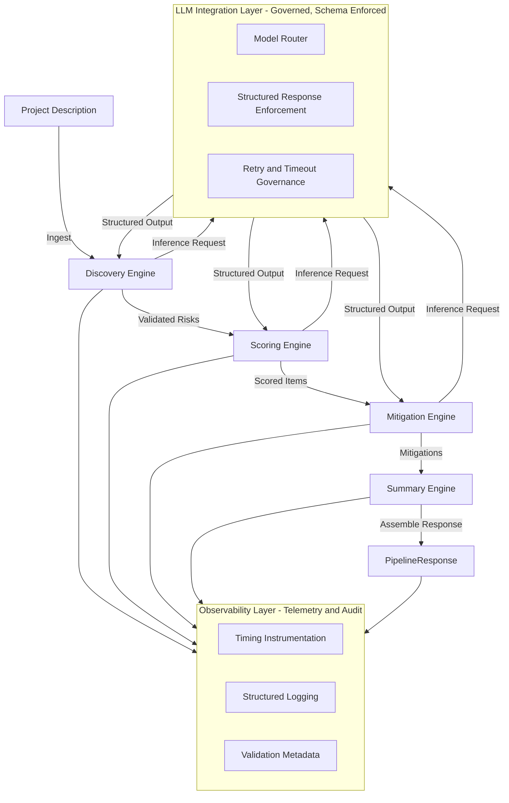

# PreMortem AI


PreMortem AI is an automated, deterministic pre-mortem engine that identifies failure scenarios
*before* a project begins. 

It transforms free-form project descriptions into a structured, end-to-end risk intelligence package — 
including discovery, scoring, mitigation strategies, thematic analysis, and an executive-ready summary.

Designed and built as a production-grade GenAI system, PreMortem AI emphesizes auditability, 
deterministic outputs, and governed reasoning to enable consistent and repeatable decision-making,
making it suitable for engineering teams, product organizations, and enterprise environments where reliability and 
traceability are a non-negotiable.

---

## 1. Overview

PreMortem AI transforms ambiguous project inputs into a structured, validated, and actionable risk report.

The pipeline produces:

- Structured risk items with stable IDs  
- Probability and impact scoring  
- Mitigation strategies tied to each risk  
- Thematic groupings and executive summaries  
- A deterministic `PipelineResponse` for downstream automation  

The architecture prioritizes **reproducibility, schema guarantees, observability, and extensibility**.

---

## 2. High-Level Architecture

PreMortem AI follows a layered, domain-driven architecture engineered for control and auditability.

**LLM Integration Layer**  
Centralized inference, model routing, schema-enforced responses.

**Domain Engines**  
Modular, testable engines for Discovery, Scoring, Mitigation, and Summary generation.

**Pipeline Orchestration Layer**  
Executes domains in sequence with strict validation boundaries and deterministic state management.

**Core Utilities**  
ID generation, logging, text normalization, schema validation, file I/O, and timing instrumentation.

**API + CLI Interfaces**  
A governed FastAPI service and CLI entrypoint for both interactive and automated workflows.

**Configuration Layer**  
Model selections, environment overrides, and pipeline feature flags.

This structure ensures clean separation of concerns and enterprise-grade maintainability.

### Architecture Diagram

The diagram below illustrates the deterministic, governed architecture that powers PreMortem AI.



---

## 3. Repository Structure

```
pre​mortem_ai/
├── analysis_service/      
│   # Optional external analysis layer for batch workflows, scheduled jobs,
│   # or downstream integrations that consume structured pipeline output.
│
├── api/
│   # Public-facing FastAPI interface with request/response models,
│   # routing, dependency injection, and server entrypoints.
│   # Keeps transport concerns isolated from internal pipeline logic.
│
├── config/
│   # Centralized configuration: feature flags, environment overrides,
│   # model routing rules, and pipeline tuning parameters.
│   # Ensures deterministic behavior across environments.
│
├── core/
│   # Fundamental primitives: ID generation, deterministic hashing,
│   # schema validation helpers, normalization utilities, and shared constants.
│   # Everything in this layer must remain side-effect free.
│
├── domains/
│   # Domain engines implementing the four canonical phases:
│   # Discovery, Scoring, Mitigation, and Summary.
│   # Each engine is fully self-contained, testable, and schema-driven.
│
├── exceptions/
│   # Typed exception hierarchy enabling predictable failure modes and
│   # structured error propagation throughout the pipeline.
│
├── llm/
│   # Governed LLM integration layer:
│   # - schema-enforced prompts
│   # - retry and timeout policies
│   # - centralized OpenAI client
│   # - deterministic routing across model tiers
│   # No domain logic is permitted in this layer.
│
├── models/
│   # Pydantic V2 models defining strict input/output schemas for all
│   # pipeline stages and intermediate artifacts. Provides the contract
│   # that governs every LLM interaction.
│
├── observability/
│   # Structured logging, timing instrumentation, metadata capture,
│   # and audit utilities. Ensures full traceability of every pipeline run.
│
├── pipelines/
│   # Orchestration layer controlling deterministic execution flow:
│   # - execution graph (Discovery → Scoring → Mitigation → Summary)
│   # - context management
│   # - cross-stage validation boundaries
│   # - final PipelineResponse assembly
│   # This is the system’s authoritative control plane.
│
├── tests/
│   # Unit and integration tests covering domain engines, orchestration logic,
│   # schema compliance, and failure simulations.
│   # Maintains pipeline reliability across iterations and deployments.
│
└── utils/
    # Shared utilities for text processing, file I/O, serialization,
    # and helper functions that do not belong to any domain or pipeline layer.
```

Each folder corresponds to a specific architectural responsibility:
domain engines, inference governance, orchestration, schemas, observability, and developer entrypoints.

---

## 4. Installation

PreMortem AI requires Python 3.10+ and installation inside a virtual environment is recommended.

### 4.1 Clone the repository

```bash
git clone https://github.com/matthewvannicola/premortem_ai.git
cd premortem_ai
```

### 4.2 Create and activate a virtual environment

```bash
python -m venv venv
source venv/bin/activate    # macOS/Linux
venv\Scripts\activate       # Windows
```

### 4.3 Install dependencies

```bash
pip install -r requirements.txt
```

### 4.4 Install the package locally (optional, recommended)

```bash
pip install -e .
```

### 4.5 Configure environment variables (if needed)

Model routing, logging verbosity, and feature flags can be configured in:

- `config/settings.py`
- `config/pipeline_configs.py`

After installation, you can run the API server or CLI as documented below.

---

## 5. Processing Flow

The pipeline executes in four deterministic stages, each producing validated structured data.

### 5.1 Discovery  
Extracts atomic risks, normalizes text, assigns stable IDs, and produces `RiskItem` objects.

### 5.2 Scoring  
Assigns probability and impact using rules + LLM-assisted scoring; outputs `ScoreItem` objects.

### 5.3 Mitigation  
Generates actionable mitigation strategies tied to each risk; outputs `MitigationItem` objects.

### 5.4 Summary  
Synthesizes themes and executive-level insight into a `Summary` object.

All outputs must successfully parse into their Pydantic V2 schemas.  
Any validation failure halts the pipeline with a typed structured error.

---

## 6. Pipeline Orchestration

The orchestration layer governs deterministic execution:

**execution_graph.py**  
Defines `Discovery → Scoring → Mitigation → Summary` and enforces stage ordering.

**context_manager.py**  
Maintains validated intermediate state and provides controlled cross-domain access.

**orchestrator.py**  
Runs the graph, validates boundaries, tracks timings, logs metadata, and emits a final `PipelineResponse`.

Guarantees:

- Reproducible runs  
- Fully typed inputs/outputs  
- No mutation once a stage is finalized  
- Clear audit trails for compliance and debugging  

---

## 7. LLM Integration Layer

All inference is routed through a governed integration layer that guarantees structured, schema-validated outputs.

**openai_client.py**  
Centralized client for outbound LLM calls, enforcing model versioning, retries, timeouts, and input/output logging.

**model_router.py**  
Deterministically maps domain engines to specific model tiers (e.g., `gpt-5.1`, `gpt-4o-mini`).

**Structured Prompt Templates**  
Tightly constrained prompts define required schema fields and minimize variability.

**Structured Response Enforcement**  
Every LLM response must parse into the domain’s schema.  
If parsing fails, the pipeline halts and returns a typed `ValidationError`.

This layer converts LLM output from raw text into **contract-enforced structured data**.

---

## 8. API Usage

Start the FastAPI server:

```bash
uvicorn premortem_ai.api.fastapi_app:app --reload
```

Send a request:

```http
POST /analyze
{
  "project_description": "..."
}
```

Returns a full `PipelineResponse` with risks, scores, mitigations, themes, and summary.

---

## 9. CLI Usage

```bash
premortem analyze "Your project description here"
```

Outputs results to console or saves as JSON.

---

## 10. Configuration

Centralized in `config/settings.py` and `pipeline_configs.py`.

Supports environment overrides, model routing rules, feature toggles, logging verbosity, and output paths.

---

## 11. Why PreMortem AI Outperforms Existing Tools

- **Strict Schema Guarantees** prevent malformed or ambiguous LLM output.  
- **Deterministic Pipeline Execution** ensures reproducible results across runs.  
- **Modular Domain Engines** enable independent upgrades and testing.  
- **Governed LLM Integration** ensures stable, auditable model behavior.  
- **Enterprise Observability** provides logs, timings, and metadata for diagnostics.  

---

## 12. Project Goals & Engineering Philosophy

PreMortem AI is engineered as a deterministic, governed risk-analysis system rather than a traditional prompt-chain tool. Its design centers on creating an auditable, reproducible pipeline that organizations can trust inside larger automation environments.

The core engineering goals are:

- **Determinism** — identical inputs should produce structurally identical outputs with no unexplained variation.
- **Auditability** — every stage must be inspectable, typed, logged, and traceable through structured metadata.
- **Extensibility** — domain engines, scoring heuristics, and mitigation logic should be replaceable or augmentable without affecting other components.
- **Governance** — all LLM interactions must pass through a schema-enforced, contract-driven integration layer.
- **Separation of Concerns** — pipeline orchestration, inference, domain logic, and observability remain fully isolated to ensure maintainability.

This philosophy aligns with how enterprise automation and AI governance systems are built, allowing PreMortem AI to serve as a reliable, production-grade building block within larger decision-making or compliance workflows.

---

## 13. Roadmap

The following roadmap reflects the planned evolution of PreMortem AI as it matures into a broader automation and analysis platform. Items are grouped by expected development horizon but are designed to remain modular and non-breaking.

### Near-Term
- Additional scoring heuristics and industry-specific weighting profiles  
- Expanded test coverage across all domain engines and the pipeline orchestrator  
- Configurable rule sets for different project types (engineering, compliance, product, operational risk)  
- Improved error classification and recovery paths within the LLM integration layer  

### Mid-Term
- Interactive web-based dashboard for submitting descriptions and visualizing risk outputs  
- CI/CD automation for schema validation, deterministic run enforcement, and regression detection  
- Plugin architecture allowing organizations to register custom discovery, scoring, or mitigation modules  
- Model benchmarking utilities for evaluating response quality across OpenAI model tiers  

### Long-Term
- Dataset export and training hooks for domain-specific fine-tuning  
- Extended domain packs (security, financial exposure, regulatory compliance, operations)  
- Enterprise observability integrations (OpenTelemetry, Prometheus, SIEM pipelines)  
- Support for multi-agent evaluation flows and cross-domain consensus scoring  

The roadmap is intentionally flexible so teams can introduce enhancements without disrupting core pipeline guarantees.

---

## 14. Contributing

Contributions are welcome. To preserve the determinism, auditability, and architectural boundaries of the system, contributions should follow these guidelines:

### General Guidelines
- Open an issue before submitting major changes so architectural implications can be discussed.
- Keep domain engines self-contained and free of implicit assumptions about other domains.
- Ensure all changes include appropriate schema updates, tests, and documentation.
- Maintain strict separation between orchestration logic, domain logic, and LLM governance.

### LLM Integration Requirements
- All LLM interactions must pass through the governed integration layer.
- New prompts must define explicit schema expectations and enforce structured output parsing.
- Avoid adding free-form or unconstrained LLM calls that cannot be validated.

### Pull Requests
- Pull requests should be atomic and focused on a single concern.
- Include a clear description of intent, architectural impact, and any new dependencies.
- Ensure tests pass and linting/formatting standards are met.

This project prioritizes clarity, determinism, and modular engineering. Contributions aligned with these principles are encouraged.

---

## 15. Potential Additions

PreMortem AI is designed with extensibility in mind. Future enhancements may include:

- **Model Benchmarking Suite**  
  Automated evaluation of model tiers, response quality, and latency across domains.

- **Interactive Web UI**  
  A lightweight dashboard for submitting project descriptions and visualizing pipeline outputs.

- **Extended Domain Engines**  
  Support for additional risk classes such as compliance, security, or financial exposure.

- **Custom Plugin System**  
  Allow organizations to register their own scoring rules, mitigation templates, or summary logic.

- **Advanced Observability**  
  Integration with OpenTelemetry, Prometheus, or enterprise SIEM systems.

- **Dataset Export + Training Hooks**  
  Export structured pipeline outputs for fine-tuning domain-specific LLM models.

- **CI/CD Integration**  
  Tests, schema checks, and pipeline determinism validation during deployment.

These additions preserve PreMortem AI’s deterministic foundation while expanding its usability across more enterprise scenarios.

---

## 16. License

MIT License — see `LICENSE`.

---

## Contact

- GitHub: https://github.com/matthewvannicola  
- LinkedIn: https://www.linkedin.com/in/matthew-vannicola  
- Portfolio: https://sites.google.com/view/matthew-vannicola-ai/  
- Email: matthew.vannicolajr@gmail.com  

---

Contributions are welcome via pull request or issue submission.
