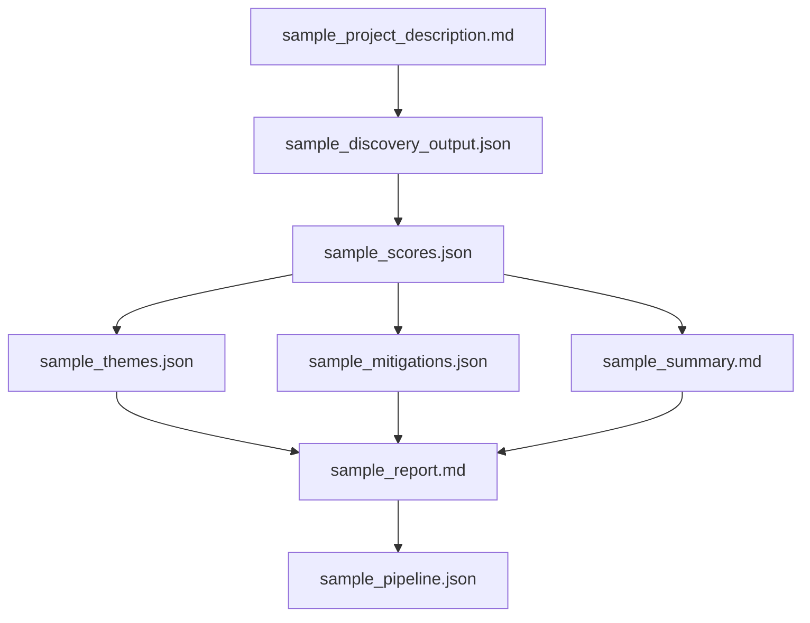

# Examples Overview

This folder contains complete, end-to-end example assets demonstrating how the **PreMortem AI** pipeline works.  
Each file represents a different stage of the automated analysis workflow, from initial project intake through final report generation.

These examples allow developers and stakeholders to quickly understand:

- What the system expects as input  
- What each LLM prompt produces as output  
- How data flows through the pipeline  
- How the final executive report is assembled  

---

## 1. Input Example

### **sample_project_description.md**
A realistic example of the raw project description provided by a user, PM, or engineering lead.  
This file is used as the **input** to the Discovery Prompt.

---

## 2. Discovery Output

### **sample_discovery_output.json**
Raw LLM-generated list of risks extracted from the project description.  
Contains only:  
- id  
- title  
- description  
- category  

This corresponds to:  
`/prompts/premortem_discovery.md`

---

## 3. Scoring Output

### **sample_risks.json**
Discovered risks **before scoring** (same as discovery output, alternate format).

### **sample_scores.json**
Each risk annotated with:  
- probability  
- impact  
- llm_score  
- model_reasoning  

This corresponds to:  
`/prompts/risk_scoring_prompt.md`

---

## 4. Theme Classification

### **sample_themes.json**
Risks grouped into higher-level themes with explanations.  
Matches output of:  
`/prompts/risk_theme_prompt.md`

---

## 5. Mitigation Output

### **sample_mitigations.json**
Each risk receives a targeted mitigation strategy.  
Corresponds to:  
`/prompts/mitigation_prompt.md`

---

## 6. Executive Summary

### **sample_summary.md**
A non-technical, executive-friendly summary generated by:  
`/prompts/summary_prompt.md`

---

## 7. Final Report Output

### **sample_report.md**
A complete, formatted pre-mortem report including:

- Title + project overview  
- Executive summary  
- Risk list with scoring  
- Mitigation strategies  
- Thematic insights  

This is the final assembly stage produced by:  
`/prompts/final_report_prompt.md`

---

## 8. End-to-End Example

### **sample_pipeline.json**
A consolidated JSON file showing all intermediate and final data structures in one place.  
Useful for:

- Understanding the entire flow  
- API integrations  
- Testing automation  
- Validating schema compatibility  

---

# How the Examples Fit Together

